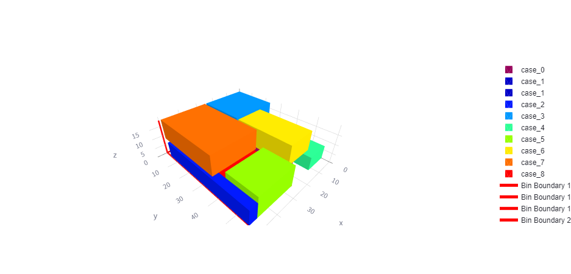
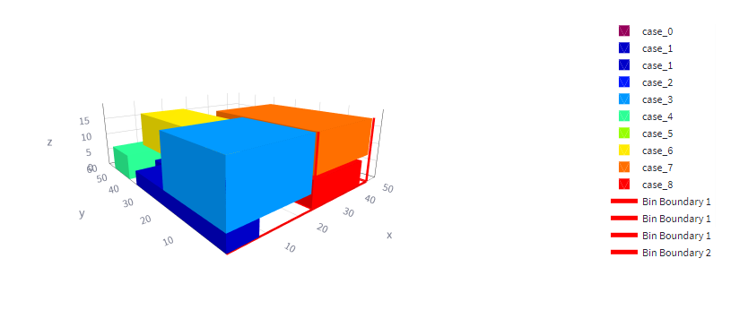
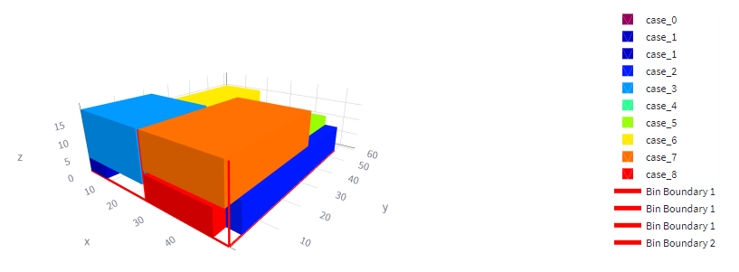
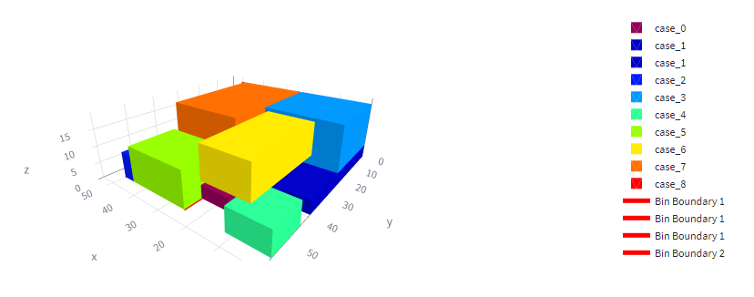

# Bin Packing Problem

The problem presented is the following:

You need a fairly optimal way to bunch of small boxes into a big box.  It doesn't need to be perfect, as coming up with a provably optimal solution is likely a really hard problem.
The input is a text file with a listing of integer volumes(width, length, height).  The first line is the container volume, the rest are the volumes of boxes to be placed inside.
Place as many as you can.
Output the best configuration you find to optimize the number of boxes put into the container, and/or the configuration that most fully utilizes the space within the container.
If you write in a low-level language, you can use a library for basic data structures. Sample input for the problem can be found in the file [input.txt](./input.txt).

This is clearly a (much more complicated version) of the famous [bin packing problem](https://en.wikipedia.org/wiki/Bin_packing_problem). 
This problem is known to be NP. 
So, developing a solution that is efficient unlikely. 

The version of the problem presented here has the extra complications of taking place in 3 dimensions. 
This introduces a number of considerations, including:
- the possibility of rotating the boxes in order to fit (if allowed). Essentially boxes may have 6 different orientations.
- gravity - boxes cannot "float" in the bin and need to be on the bottom of the bin or another box
- stability - boxes need to be supported or they will "tip over". Thus a box should have another box or a bin under its center of gravity at the very least
- value for boxes - is not given in this problem, but typically some boxes have more value than others and should be prioritized.

## Literature Review

I decided to do a quick literature review, as this problem has been studied.
The branch and bound technique for this particular problem was developed in the article by [Pisinger and Vigo](./BranchAndBoundSolution.pdf).
This technique is typically useful for NP problems. 
By providing optimization bounds on exploring branches of the solution spaces, we can "prune" the solution space tree and reduce exploring all solutions.

More recently, in 2023, an approximation method for solving this problem was presented in [Nature](./NatureArticle.pdf).
This article recast the problem as an optimization problem whereby the goal is to minimize
- number of bins used (not a concern for our problem)
- the average height of the items in the bins 
- the gaps between items
with respect to the following constraints
- each item must have one orientation
- no overlap between packages
- each item must be used at most once (no duplicate items)
- the item weight is within the maximum capacity of the bin (not a concern for our problem)

The objective functions plus the constraints give us a constrained quadratic model (CQM) which is detailed here: [Leap hybrid CQM](https://docs.dwavesys.com/docs/latest/doc_leap_hybrid.html).

## Approach
I decide to make use of the dwave solver. 
I loaded the code into a GitHub codespace ([repo](https://github.com/JBecnel/3d-bin-packing)) and ran the solver for one minute. 
The output produced the solution found in [solution](./solution.txt).
To fit all the boxes we would require two separate bins.
The problem requested the bin that takes the highest number of boxes.
This would be bin 1, which holds 6 of the boxes.

Here are visuals with all boxes loaded into two side-by-side bins.

# Further Considerations
The above is an approximation. In fact, you may notice that case 6 (in yellow) is not stable.
If exact results are warranted we must consider implementing the branch and bound algorithm. 
However, if there are fixed time constraints, this appears to be a suitable means of approximation.
Of course, to continue using the dwave system would require paying for quantum computer access.
There are classical approximation algorithms that could be attempted but the "goodness" of approximation can vary. 
For example, in its current form, the [python-MIP](https://docs.python-mip.com/en/latest/index.html) was unable to handle the quadratic interactions.
